  

# 🚀 Mi actividad reciente:

| Últimos pull requests | Últimos pushes | Últimas ramas |
| --- | --- | --- |
| 📝 [Add e2e testing workflow and configure Serenity reports](https://github.com/CarlosGC123/TicketPe-Testing-Web/pull/1) · 📦 [_TicketPe-Testing-Web_](https://github.com/CarlosGC123/TicketPe-Testing-Web) · 🔀 `CarlosGC123:feat/ci → CarlosGC123:master` | 📦 [_TicketPe-Testing-Web_](https://github.com/CarlosGC123/TicketPe-Testing-Web) · 🔢 **undefined** · 🌿 `master` 📦 [_TicketPe-Testing-Web_](https://github.com/CarlosGC123/TicketPe-Testing-Web) · 🔢 **undefined** · 🌿 `master` 📦 [_TicketPe-Testing-Web_](https://github.com/CarlosGC123/TicketPe-Testing-Web) · 🔢 **undefined** · 🌿 `master` | Sin actividad reciente. |

## 📊 GitHub Stats:

## 🏆 GitHub Trophies

## 🌐 Socials:

